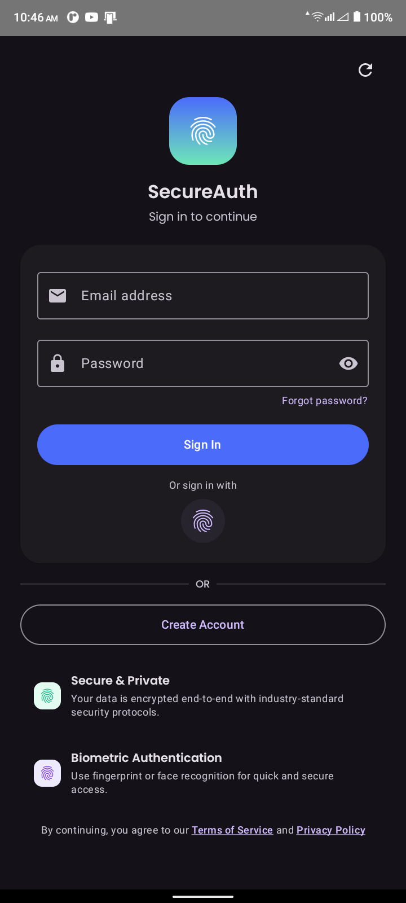
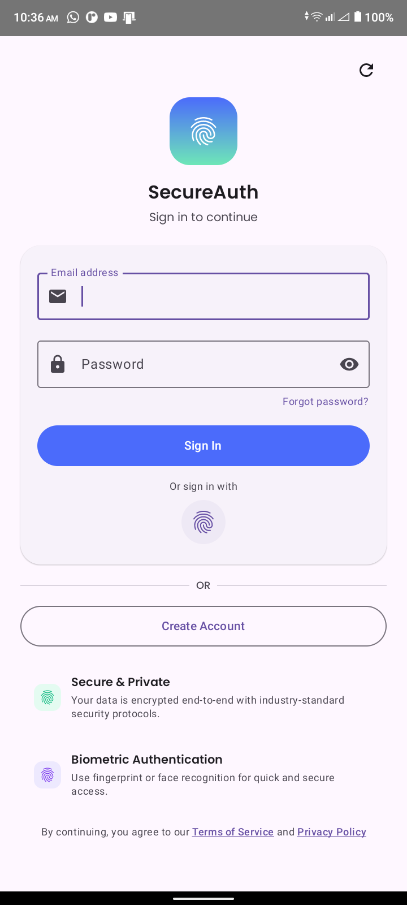
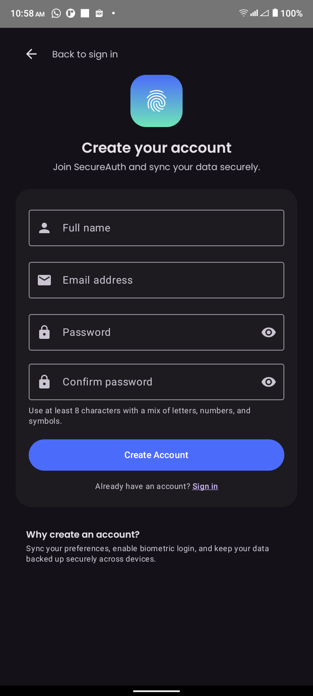
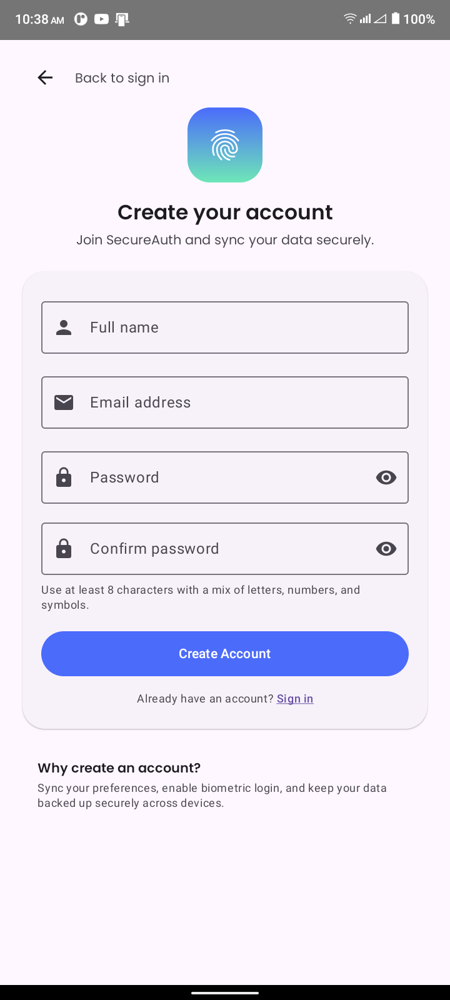
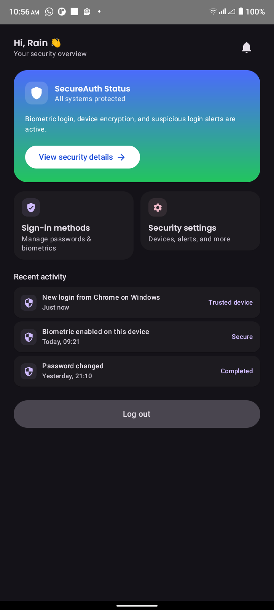
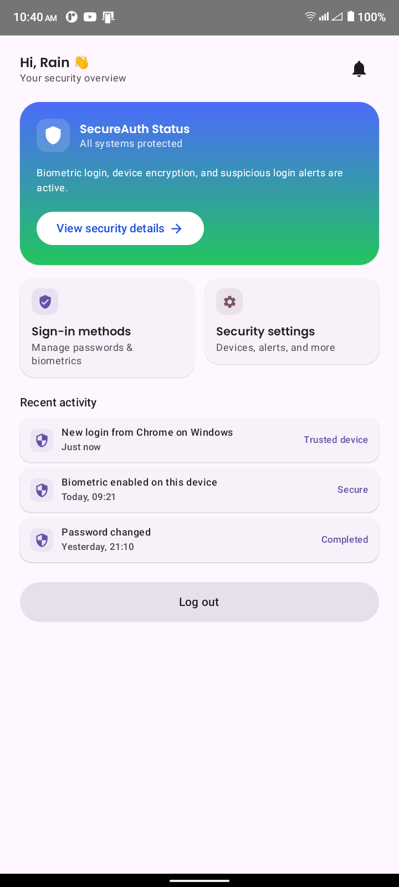
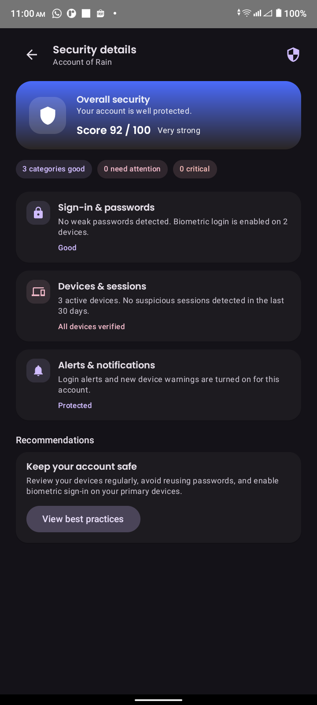
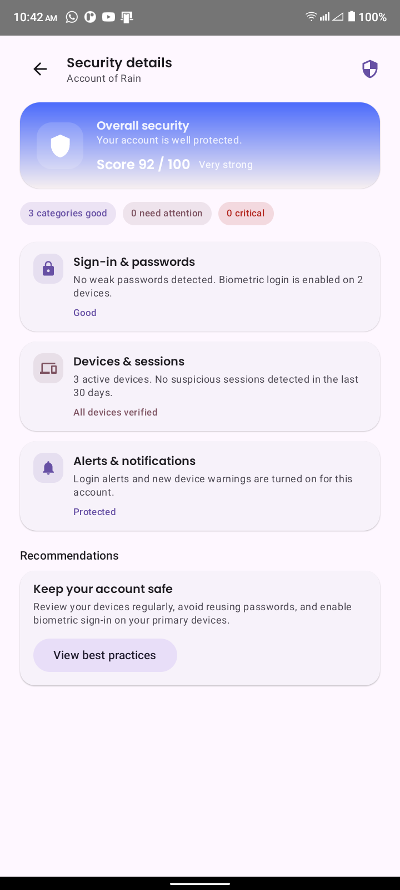
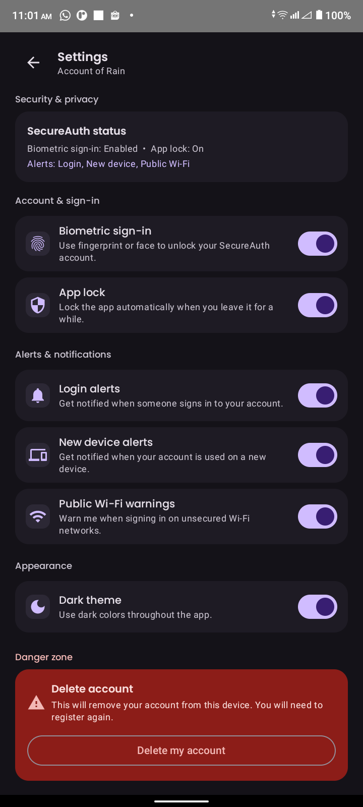
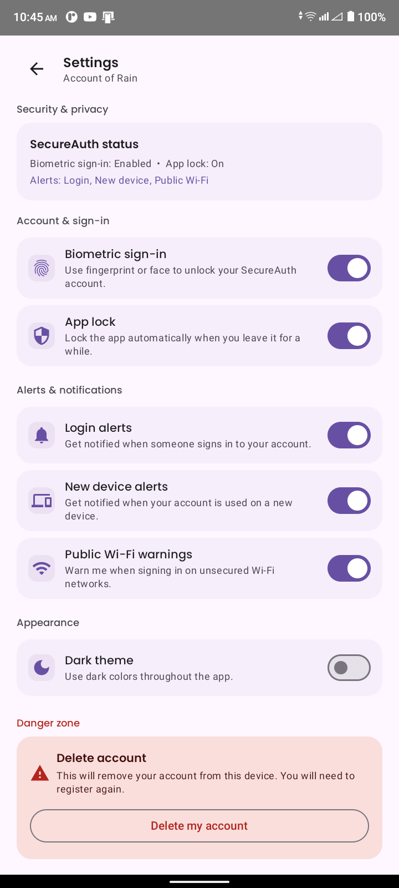

#  SecureAuth: Praktikum #7 - Menerapkan Desain UI Modern

Aplikasi **SecureAuth** merupakan hasil praktikum ke-7 yang berfokus pada implementasi desain antarmuka modern menggunakan **Jetpack Compose** dan **Material Design 3**. Proyek ini menekankan pada pengalaman pengguna (UX) yang intuitif, keamanan biometrik terintegrasi, dan fleksibilitas tema dinamis.

##  Tech Stack & Tools

Proyek ini dibangun menggunakan standar pengembangan Android modern untuk memastikan performa dan skalabilitas:

| Tools & Libraries | Badge | Deskripsi |
| :--- | :--- | :--- |
| **Kotlin** |  | Bahasa utama pengembangan Android modern. |
| **Jetpack Compose** |  | Toolkit UI deklaratif untuk membangun antarmuka. |
| **Android Studio** |  | IDE resmi untuk pengembangan aplikasi Android. |
| **Material 3** |  | Standar desain terbaru untuk komponen UI Google. |

## 📁 Struktur Proyek (Project Structure)

Berdasarkan arsitektur yang diterapkan, proyek ini diorganisir secara sistematis untuk mendukung skalabilitas dan kemudahan pemeliharaan kode:

```text
id.antasari.p7_modern_ui_230104040205
├── ui/
│   ├── auth/                # Logika dan State Autentikasi
│   │   ├── AuthViewModel.kt
│   │   └── SecureAuthApp.kt
│   ├── components/          # Reusable UI Elements (Atomic Design)
│   │   ├── AppButton.kt
│   │   ├── AppCard.kt
│   │   ├── AppTextField.kt
│   │   ├── SectionHeader.kt
│   │   └── TopBar.kt
│   ├── navigation/          # Pengaturan Alur Navigasi Aplikasi
│   │   └── AppNavHost.kt
│   └── theme/               # Material 3 Styling & Design System
│       ├── Color.kt
│       ├── Shape.kt
│       ├── Theme.kt
│       └── Type.kt
├── AccountStorage.kt        # Manajemen Penyimpanan Akun Lokal
├── BiometricUtils.kt        # Utilitas Keamanan Biometrik
├── CreateAccountScreen.kt   # UI Pendaftaran Akun
├── HomeScreen.kt            # UI Dashboard Utama
├── LoginScreen.kt           # UI Masuk Aplikasi
├── MainActivity.kt          # Entry Point & Lifecycle Management
├── SecurityDetailsScreen.kt # UI Analitik Keamanan
└── SettingsScreen.kt        # UI Pengaturan Aplikasi

```

## 🌟 Fitur Utama

* **Modern Design System**: Implementasi tipografi **Poppins** dan komponen Material 3 yang disesuaikan untuk estetika modern.
* **Security Score Analytics**: Visualisasi skor keamanan (92/100) yang interaktif bagi pengguna.
* **Biometric Authentication**: Keamanan tingkat lanjut menggunakan sensor sidik jari atau pengenalan wajah perangkat.
* **Dynamic Theme Switching**: Dukungan penuh dan adaptasi otomatis antara *Dark Mode* dan *Light Mode*.
* **App Lock Logic**: Sistem keamanan otomatis yang mengunci aplikasi saat berada di background.

## 📸 Dokumentasi Visual (App Flow)

Berikut adalah 10 layar utama yang mengimplementasikan Desain UI Modern:

### 1. Autentikasi (Login & Register)

| Layar | Dark Mode | Light Mode |
| --- | --- | --- |
| **Login** |  |  |
| **Register** |  |  |

### 2. Dashboard & Keamanan

| Layar | Dark Mode | Light Mode |
| --- | --- | --- |
| **Dashboard** |  |  |
| **Security Details** |  |  |

### 3. Pengaturan (Settings)

| Layar | Dark Mode | Light Mode |
| --- | --- | --- |
| **Settings** |  |  |

---

**Informasi Mahasiswa:**

* **Nama**: Ivan Dwika Bagaskara (Rain/Hujan)
* **NIM**: 230104040205
* **Mata Kuliah**: Mobile Programming
* **Praktikum**: #7 Menerapkan Desain UI Modern

```